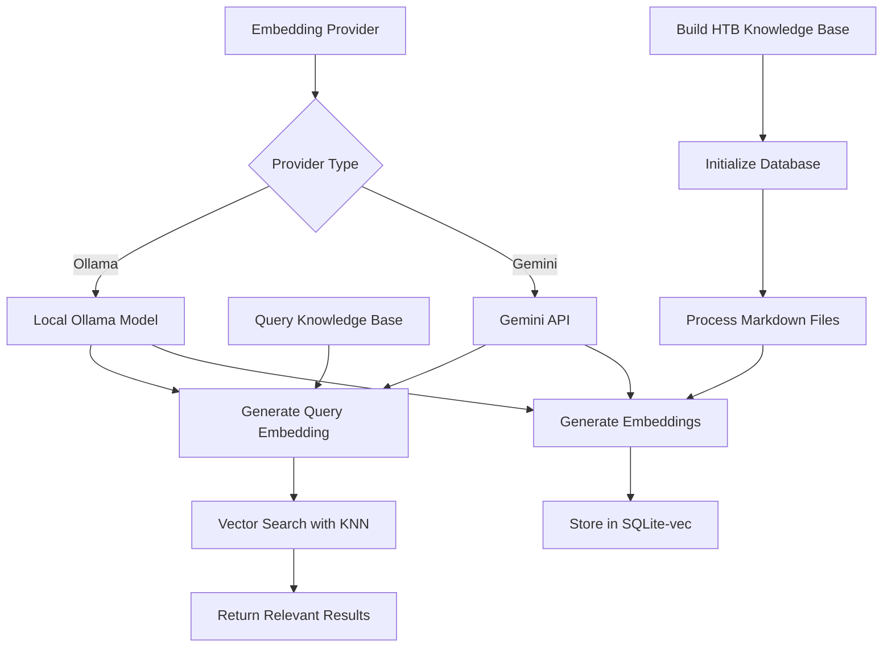

# HTB Knowledge Base with Vector Embeddings

This document explains how to set up and use the HTB (HackTheBox) knowledge base with vector embeddings using sqlite-vec. The system supports both Gemini and Ollama embedding models for semantic search across pentesting techniques and methodologies.

## Overview

The HTB Knowledge Base tool provides:
- Vector embeddings for HackTricks documentation
- Semantic search using KNN (K-Nearest Neighbors)
- Support for both cloud (Gemini) and local (Ollama) embedding models
- Persistent SQLite database with sqlite-vec extension
- Fast similarity search for pentesting techniques

## Architecture



## Prerequisites

### 1. Install Dependencies

From the project root:

```bash
cd packages/core
npm install
npm run build
cd ../..
```

### 2. Set Up HackTricks Database

The HackTricks database should already be downloaded in the `hacktricks-db/` directory. If not, run:

```bash
node scripts/download-hacktricks.js
```

### 3. Configure Embedding Provider

#### Option A: Use Gemini (Default)

Ensure you have Gemini API access configured. The tool will use your existing Gemini authentication.

#### Option B: Use Ollama (Local)

1. Install Ollama: https://ollama.ai/
2. Download an embedding model:
   ```bash
   ollama pull nomic-embed-text
   ```
3. Set environment variable:
   ```bash
   export HTB_EMBEDDING_MODEL=ollama
   ```

## Building the Knowledge Base

### Basic Build

```bash
# Build with Gemini embeddings (default)
node scripts/build-htb-knowledge-base.js build

# Build with Ollama embeddings
HTB_EMBEDDING_MODEL=ollama node scripts/build-htb-knowledge-base.js build
```

### Custom Ollama Model

```bash
# Use a specific Ollama model
HTB_EMBEDDING_MODEL=ollama HTB_OLLAMA_MODEL=llama2 node scripts/build-htb-knowledge-base.js build
```

### What Happens During Build

1. Initializes SQLite database with sqlite-vec extension
2. Scans `hacktricks-db/pentesting-web/` and `hacktricks-db/network-services-pentesting/`
3. Extracts title, summary, and content from each markdown file
4. Generates embeddings for each document
5. Stores embeddings in vector table for fast similarity search

## Querying the Knowledge Base

### Basic Query

```bash
# Search for SQL injection techniques
node scripts/build-htb-knowledge-base.js query --query "SQL injection bypass"

# Search for XSS vulnerabilities
node scripts/build-htb-knowledge-base.js query --query "XSS payload"
```

### Advanced Queries

```bash
# Filter by category (web or network)
node scripts/build-htb-knowledge-base.js query --query "authentication bypass" --category web

# Limit results
node scripts/build-htb-knowledge-base.js query --query "SMB enumeration" --limit 10

# Combined filters
node scripts/build-htb-knowledge-base.js query --query "SSRF" --category web --limit 3
```

### Using in Gemini CLI

Once built, the knowledge base is automatically available in the Gemini CLI:

```bash
gemini
> @htb_knowledge_base search for SQL injection techniques
> @htb_knowledge_base how to bypass login forms
> @htb_knowledge_base LDAP injection in web category
```

## Database Information

Check database statistics:

```bash
node scripts/build-htb-knowledge-base.js info
```

Output example:
```
HTB Knowledge Base Statistics:
==============================
Total documents: 245
Web pentesting: 156
Network pentesting: 89
Database size: 42.3 MB
Database location: /path/to/htb-knowledge.db

Embedding provider: ollama
Ollama model: nomic-embed-text
```

## Configuration Options

### Environment Variables

| Variable | Description | Default |
|----------|-------------|---------|
| `HTB_EMBEDDING_MODEL` | Embedding provider: 'gemini' or 'ollama' | 'gemini' |
| `HTB_OLLAMA_MODEL` | Ollama model name | 'nomic-embed-text' |
| `HTB_EMBEDDING_DIMENSIONS` | Vector dimensions | 768 |

### Command-Line Options

| Option | Description | Example |
|--------|-------------|---------|
| `--model` | Override embedding provider | `--model ollama` |
| `--ollama-model` | Specify Ollama model | `--ollama-model mistral` |
| `--query` | Search query text | `--query "RCE techniques"` |
| `--limit` | Maximum results | `--limit 10` |
| `--category` | Filter category | `--category web` |

## Troubleshooting

### Common Issues

1. **Database not found error**
   ```bash
   # Ensure database is built first
   node scripts/build-htb-knowledge-base.js build
   ```

2. **Ollama connection error**
   ```bash
   # Check Ollama is running
   ollama list
   
   # Start Ollama if needed
   ollama serve
   ```

3. **Gemini API error**
   ```bash
   # Ensure Gemini is authenticated
   gemini auth
   ```

4. **Out of memory during build**
   ```bash
   # Increase Node.js memory limit
   NODE_OPTIONS="--max-old-space-size=4096" node scripts/build-htb-knowledge-base.js build
   ```

### Performance Tips

1. **Use Ollama for offline/faster builds**: Local embeddings are faster than API calls
2. **Rebuild periodically**: Update embeddings when HackTricks content changes
3. **Optimize queries**: Use specific terms for better results
4. **Category filtering**: Use `--category` to narrow search scope

## Technical Details

### Database Schema

```sql
-- Main documents table
CREATE TABLE documents (
  id INTEGER PRIMARY KEY AUTOINCREMENT,
  doc_id TEXT UNIQUE NOT NULL,
  title TEXT NOT NULL,
  content TEXT NOT NULL,
  file_path TEXT NOT NULL,
  category TEXT NOT NULL,
  summary TEXT,
  created_at TIMESTAMP DEFAULT CURRENT_TIMESTAMP
);

-- Vector embeddings table (sqlite-vec virtual table)
CREATE VIRTUAL TABLE vec_documents USING vec0(
  embedding float[768]
);
```

### Embedding Process

1. **Text preparation**: Combines title, summary, and first 1000 chars of content
2. **Embedding generation**: 768-dimensional vectors by default
3. **Storage**: Float32 arrays in sqlite-vec format
4. **Search**: L2 distance for KNN queries, with cosine similarity display

### Supported Distance Metrics

- **L2 (Euclidean)**: Default for similarity search
- **Cosine**: Normalized angular distance
- **Hamming**: For binary vectors (future support)

## Development

### Adding New Embedding Providers

To add a new embedding provider, implement the `EmbeddingProvider` interface:

```typescript
interface EmbeddingProvider {
  generateEmbedding(text: string): Promise<number[]>;
  dimensions: number;
}
```

### Extending Categories

To add new document categories beyond 'web' and 'network', modify:
1. `HTBKnowledgeBaseParams` interface
2. `processDirectory` method in `HTBKnowledgeBaseTool`
3. Update the build script to scan new directories

## License

Copyright 2025 Google LLC
SPDX-License-Identifier: Apache-2.0 